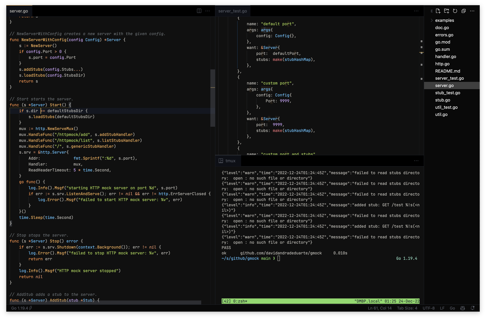
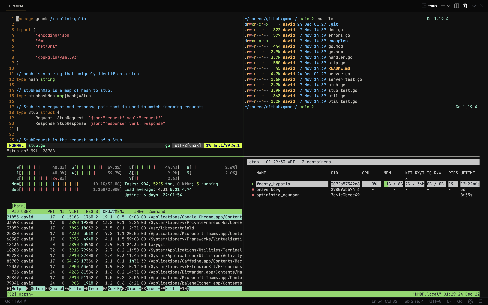

# Dotfiles

Home for my dotfiles and initial setup configurations.

No automation tools being used, just plain shell scripts and symbolic links.

Currently supports: macOS, Ubuntu.

Use at your own risk.




Table of Contents
-----------------

* [Dependencies](#dependencies)
* [Installation](#installation)
* [Installation Notes](#installation-notes)
* [Docker](#docker)
* [Testing](#testing)
* [License](#license)

## Dependencies

* [bash](https://www.gnu.org/software/bash/) (>= 4.0)
* [curl](https://curl.haxx.se/)
* [git](https://git-scm.com/)

## Installation

```sh
bash <(curl -fsSL https://raw.githubusercontent.com/davidandradeduarte/dotfiles/HEAD/install.sh)
```

Alternatively, you can clone the repository and run the `install` script:

```sh
git clone https://github.com/davidandradeduarte/dotfiles.git
cd dotfiles
./install.sh
```

**Options**

| Flag | Description | Default |
| - | - | - |
| -d, --dir | Dotfiles directory | `$HOME/.dotfiles` |
| -s, --shell | Default shell | `$SHELL` |
| -y, --yes | No prompt |
| -l, --local | Local mode |
| -h, --help | Show help |

All flags are available as environment variables in their --`name` form.

**Examples**

Using flags:

```sh
bash <(curl -fsSL https://raw.githubusercontent.com/davidandradeduarte/dotfiles/HEAD/install.sh) \
    -d $HOME/.dot -s zsh -y
```

Using environment variables:

```sh
dir=$HOME/.dot shell=zsh yes=true \
    bash <(curl -fsSL https://raw.githubusercontent.com/davidandradeduarte/dotfiles/HEAD/install.sh)
```

(booleans can be `true` or `1`)

## Installation Notes

Installation is *batteries included*, which means it installs everything by default. It can even install stuff I no longer use but haven't had time to clean yet.
There is no configuration for what is installed, it's all or nothing.
Of course you can always clone the repository and remove what you don't want.

The script will always try to pull the latest software available (except in some rare cases), so you can run the script as many times as you want to keep your system up to date.

If by any chance the script replaces a file that you have modified, you can probably find it in the same directory with a `.bak.$epoch` extension. (e.g. `~/.bashrc.bak.1620000000`)

## Docker

```sh
docker run -it --rm davidduarte/dotfiles:ubuntu
```

All options are available as environment variables too:

```sh
docker run -it --rm -e dir=$HOME/.dot -e shell=zsh -e yes=true davidduarte/dotfiles:ubuntu
```

See the available tags [here](https://hub.docker.com/r/davidduarte/dotfiles/tags).

## Testing

The `local` option allows you to test dotfiles changes by copying the current directory instead of cloning the remote repository.

Use the make targets to test the installation on different OSs or to install the dotfiles locally.

All options are available as make variables and there's an extra `quiet` flag to silence docker output.

**Examples**

Spin up a container with Ubuntu to test local changes:

```sh
cd $HOME/.dotfiles # or wherever your changes are
make ubuntu local=true
```

(if `local=true` is not set, it will clone the remote repository instead of copying your local changes)

Using all options:

```sh
make ubuntu dir=$HOME/.dot shell=zsh yes=true local=true quiet=true
```

See the available targets in the [Makefile](Makefile).

## License

[MIT](LICENSE)
